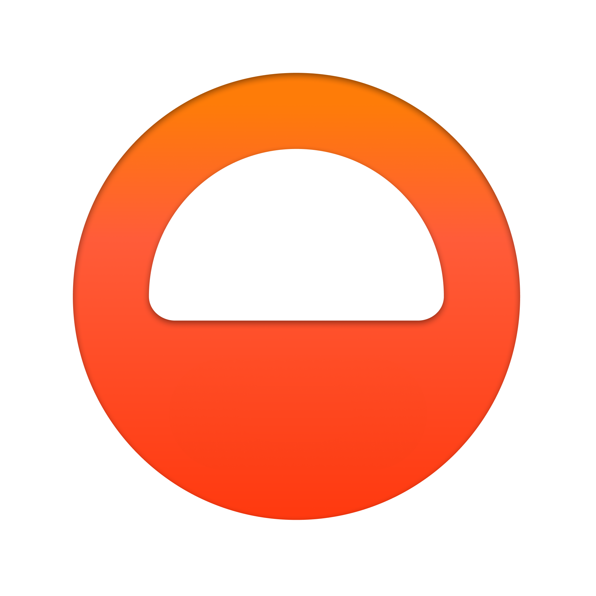

### Definition
---
```swift
func sorted(by areInIncreasingOrder: (Element, Element) throws -> Bool) 
			rethrows -> [Element]
```

**`areInIncreasingOrder` :** A predicate that returns `true` if its first argument should be ordered before its second argument; otherwise, `false`.

### 해석
---
- [ lhs ] > [ rhs ]
    - lhs가 rhs보다 큼이 true 일 때 first item을 second item보다 앞에 두자.
    - 따라서 `$0 > $1`  로 정의하면 *$0이 $1보다 크면 $0를 앞에 두자* 이므로 descending order sorting 이 됨.
- [ lhs ] < [ rhs ]
    - lhs가 rhs보다 작음이 true 일 때 first item을 second item보다 앞에 두자.
    - 따라서 $0 < $1  로 정의하면 ascending order sorting 이 됨.
- Example:
    - first string ($0)을 second string ($1) 앞에 두었을 때의 값이 ($0 + $1)
    - second string ($1)을 first string ($0) 앞에 두었을 때의 값보다 ($1 + $0)
    - 크면 $0를 $1보다 앞에 두자.

    ```swift
    someStringArray.sorted { $0 + $1 > $1 + $0 }
    ```

<!--  -->