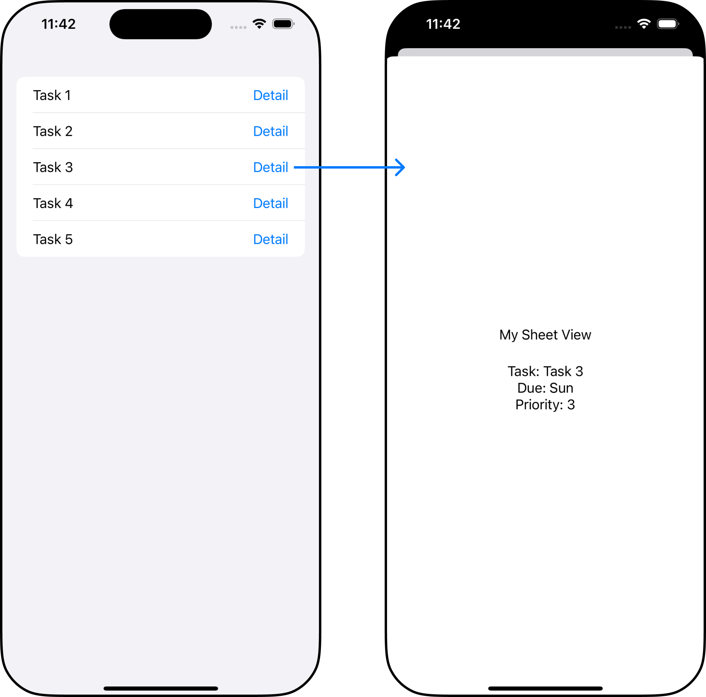

## Goal of this post

The goal of this post is to create a list that shows each row’s detail information on a modal sheet, when we tap on a button placed at each row. 

<div class="articleImage" style="max-width: 100%; width:500px; margin: 50px auto; padding-bottom: 30px;">
    
</div>

## Presenting a Sheet

There are two ways to present a sheet using a view modifier.
<br/>
There are two ways to present a sheet using a view modifier.

There are two ways to present a sheet using a view modifier.


1) binding a sheet to a boolean  
[`sheet(isPresented:onDismiss:content:)`](https://developer.apple.com/documentation/swiftui/view/sheet(ispresented:ondismiss:content:))

2) binding a sheet to an item that acts as a data source for the sheet  
[`sheet(item:onDismiss:content:)`](https://developer.apple.com/documentation/swiftui/view/sheet(item:ondismiss:content:))

Because our sheet has to display different detail information depending on which task we tap on, we want our sheet to be binded to a task item that will act as a data source for the sheet.

```swift
struct Task: Identifiable {
  var id = UUID()
  var text: String
  var dueDate: String
  var priority: Int
}

struct MySheetView: View {
  var task: Task
  
  var body: some View {
    Text("My Sheet View")
		.padding()
    Text("Task: \(task.text)")
    Text("Due: \(task.dueDate)")
    Text("Priority: \(task.priority)")
  }
}

struct ContentView: View {
  @State private var tasks = [
    Task(text: "Task 1", dueDate: "Wed", priority: 5),
    Task(text: "Task 2", dueDate: "Mon", priority: 3),
    Task(text: "Task 3", dueDate: "Sun", priority: 3),
    Task(text: "Task 4", dueDate: "Tue", priority: 5),
    Task(text: "Task 5", dueDate: "Mon", priority: 4)
  ]
  @State private var sheetTask: Task?  // 1
  
  var body: some View {
    List(tasks) { task in
      HStack {
        Text(task.text)
        Spacer()
        Button("Detail") {
          print("button clicked. \(task.text)")
          sheetTask = task   // 2
        }
      }
    }
    .sheet(item: $sheetTask) { task in  // 3
      MySheetView(task: task)
    }
  }
}
```

1. Define a @State variable `sheetTask` that tracks the tapped task. 
2. assign the tapped task to the @State variable `sheetTask`.
3. Bind the @State variable (= the data source for the sheet) to the sheet, by passing it as `item` in  `sheet(item:onDismiss:content:)`.  
    * When the @State variable `sheetTask` changes, the system dismisses the sheet and replaces it with a new one

## Common Mistakes

### Attaching the sheet view modifier to each row.

If we attach the sheet view modifier `sheet(item:onDismiss:content:)` to each row of the list, a single tap on a single button will modify each sheet view modifier’s `item`, which makes each row’s sheet to be presented.

So this will yield a warning like this: *`SwiftUI [Presentation] / Attempt to present View on ... which is already presenting`*

```swift
var body: some View {
  List(tasks) { task in
    HStack {
      Text(task.text)
      Spacer()
      Button("Detail") {
        print("button clicked. \(task.text)")
        sheetTask = task  
      }
    }
		.sheet(item: $sheetTask) { task in  // <- here
	    MySheetView(task: task)
    }
  }
}
```