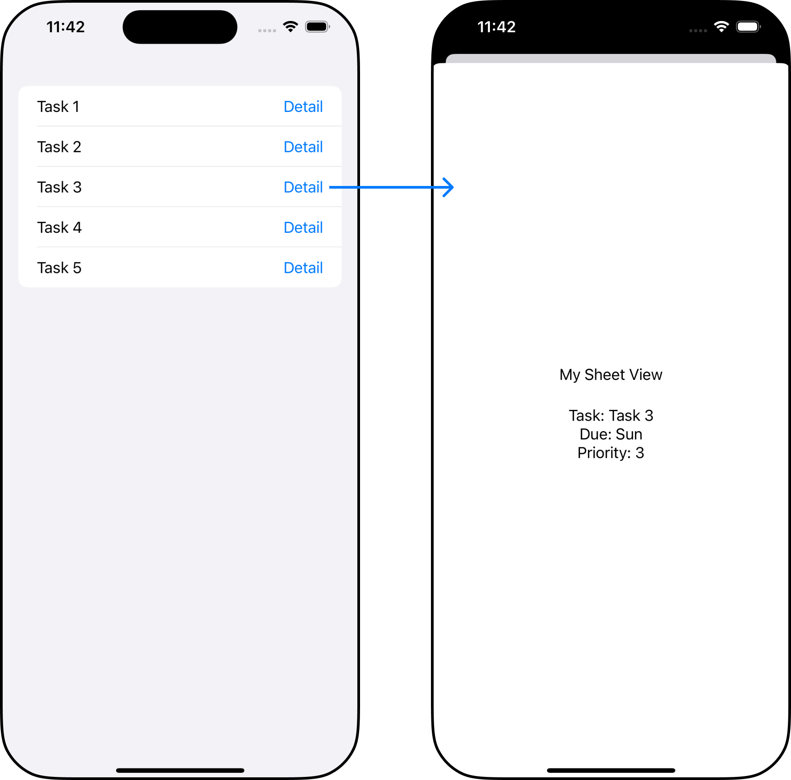

SwiftUI에서 `NavigationStack`을 사용하는 방법은 세가지가 있다. 
- `NavigationStack`과 `NavigationLink` 사용하기 
- `NavigationStack`과 `NavigationLink`, `NavigationPath` 사용하기 
- `NavigationStack`과 `NavigationPath`, `NavigationPath` 사용하기 
각각의 사용법과 차이점을 알아본다. <br/>
또한 `NavigationPath`를 사용해서 `NavigationStack`의 상태를 관리하는 방법을 알아본다. 

> 해당 포스트 내용은 iOS 16.0 이상에만 해당합니다.

<!-- <div class="articleImage" style="max-width: 100%; width:500px; margin: 50px auto; padding-bottom: 30px;">
    
</div> -->

## NavigationStack과 NavigationLink 사용하기
- 가장 심플한 케이스로, `NavigationStack`의 `init(root:)`의 root view에 `NavigationLink(destination:label:)`를 넣어준다. 
- 아래 코드는 Content view -> Next view로 이동하는 예시다.

```Swift
import SwiftUI

struct FirstExample: View {
    var body: some View {
        
        NavigationStack {
            VStack {
                Text("Root View").font(.title)
                NavigationLink {
                    NextView()
                } label: {
                    Text("See Next View")
                }
            }
        }
    }
}

struct NextView: View {
    var body: some View {
        Text("Next view")
    }
}
```

## NavigationStack과 NavigationLink, NavigationDestination 사용하기 
- 위처럼 destination view를 `NavigationLink`의 initializer 내부로 넣지 않고 따로 빼는 방법도 있다. 
- `NavigationLink`의 `init(_:,value:)`와 `.navigationDestination(for:destination:)` view modifier을 사용하는 방법이다. 
- `NavigationStack`에 link의 `value`를 제공하는 방식이다.  
- `.navigationDestination(for:destination:)`는 value의 타입에 따라서 navigation destination view를 정해주는 view modifier이다.
- 여기서 value의 타입은 `Hashable`한 타입만 제공이 가능하다. 따라서 custom type을 value로 제공하고자 하면 Hashable을 준수해야한다.
- 여러개의 navigation destination modifier를 사용 할 수도 있다. 
- 아래 코드는 Content view -> Next view로 이동하는 예시다.

```Swift
import SwiftUI

struct ContentView: View {
    var body: some View {
        
        NavigationStack {
            VStack {
                Text("Root View").font(.title)
                NavigationLink("See Next view", value: "next view")
            }
            .navigationDestination(for: String.self) { string in
                if string == "next view" {
                    NextView()
                }
            }
        }
    }
}

struct NextView: View {
    var body: some View {
        Text("Next view")
    }
}
```

## NavigationStack과 NavigationPath, NavigationDestination 사용하기 
- `NavigationStack`에 제공하는 value의 타입이 다양하다면, stack의 state를 관리하기 위해 `NavigationPath`를 이용한다. 
- `NavigationLink`로 view를 감싸는 대신 `NavigationPath`에 value를 append한다. 
- `NavigationLink`와 마찬가지로 `.navigationDestination(for:destination:)` view modifier를 사용해서 destination view를 지정한다. 
- 그리고 value는 역시 `Hashable` 해야한다.
- 아래 코드는 Content view -> Next view -> Next next view로 이동하는 예시다.

```Swift
import SwiftUI

struct ContentView: View {
    @State var path = NavigationPath()
    
    var body: some View {
        
        NavigationStack(path: $path) {
            VStack {
                Text("Root View").font(.title)
                Button(action: {
                    path.append("next view")
                }, label: {
                    Text("See Next view")
                })
            }
            .navigationDestination(for: String.self) { string in
                if string == "next view" {
                    NextView(path: $path)
                } else if string == "next next view" {
                    NextNextView()
                }
            }
        }
    }
}

struct NextView: View {
    @Binding var path: NavigationPath
    
    var body: some View {
        Button(action: {
            path.append("next next view")
        }, label: {
            Text("See Next next view")
        })
    }
}

struct NextNextView: View {
    var body: some View {
        Text("Next next view")
    }
}
```

## NavigationPath로 NavigationStack의 상태 관리하기
- navigation stack을 여러번 타고 타고 들어가서 마지막 뷰로 이동하면 root view와 미자막 뷰 사이에 여러 개의 뷰가 스택으로 쌓인다. 
- 이럴때 마지막 뷰에서 루트뷰로 한번에 돌아가고 싶은 경우가 있다. 이때 `NavigationPath`를 사용할 수 있다. 
- 한번 이동할때마다 path에 value를 append 해왔으니, 뒤로 돌아가기 위해선 value를 remove하면 되는 개념이다.
- 아래 코드는 Content view -> Next view -> Next next view -> Content view로 이동하는 예시다. 

```Swift
import SwiftUI

struct ContentView: View {
    @State var path = NavigationPath()
    
    var body: some View {
        
        NavigationStack(path: $path) {
            VStack {
                Text("Root View").font(.title)
                
                Button(action: {
                    path.append("next view")
                }, label: {
                    Text("See Next view")
                })
            }
            .navigationDestination(for: String.self) { string in
                if string == "next view" {
                    NextView(path: $path)
                } else if string == "next next view" {
                    NextNextView(path: $path)
                }
            }
        }
    }
}

struct NextView: View {
    @Binding var path: NavigationPath
    
    var body: some View {
        Text("Next View").font(.title)
        
        Button(action: {
            path.append("next next view")
        }, label: {
            Text("See Next next view")
        })
    }
}

struct NextNextView: View {
    @Binding var path: NavigationPath
    
    var body: some View {
        Text("Next next view").font(.title)
        
        Button {
            while path.count > 0 {
                path.removeLast()
            }
        } label: {
            Text("Back to root view")
        }
    }
}
```