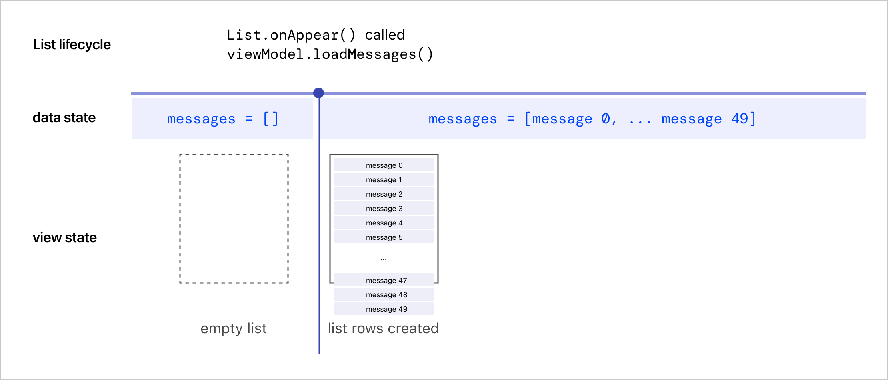
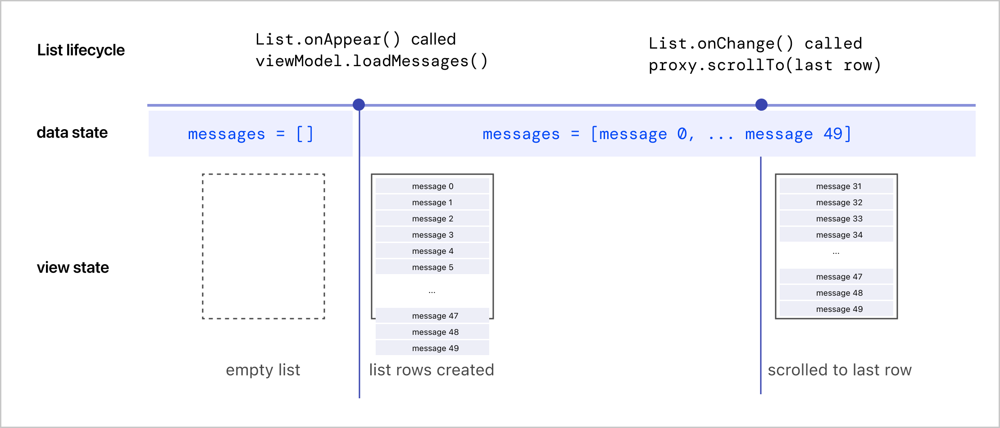

- SwiftUI `List`의 마지막 row부터 보여주고 싶을때가 있다. 
- 예를들면 채팅뷰의 메세지 List이다. 시간 순서대로 나열된 메세지 List가 있을때, 가장 최신 메세지 (last row)를 먼저 보여줘야하는 경우다.
- List의 last row가 화면의 bottom에 먼저 보이게 하기 위해서, List가 처음 그려질때 last row로 재빠르게 scroll 해주는 방법으로 원하는 UX를 구현할 수 있다. 


## 기본 채팅뷰 코드 셋업
- 총 50개의 메세지가 있는 채팅방을 가정한다. 
- 메세지는 "message 0" 부터 "message 49"까지 있고, 숫자가 작을수록 예전 메세지, 클수록 최신 메세지이다. 가장 최신 메세지는 "message 49"이다. 
- `ChatRoom` 뷰에는 각 row에 message를 보여주는 `List`가 있다. 
- `ChatRoom`에서 `messages` 데이터는 `ChatRoomViewModel`을 통해 init, load 된다. 
    - `ChatRoom`이 `init()` 될때 `viewModel.messages = []`로 초기화된다. 
    - `ChatRoom`이 처음 화면에 나타날때 (`.onAppear()`) viewModel을 통해서 50개의 메세지를 불러온다 (`viewModel.loadMessages()`). (실제 환경에서는 네트워킹이나 로컬 디비에서 메세지를 불러오겠지만, 여기 예시에서는 단순화하기 위해서 코드로 messages array를 채웠다)

```Swift
import Foundation
import SwiftUI

class Message: Identifiable, Equatable {
    var id = UUID()
    var text: String
    
    init(text: String) {
        self.text = text
    }
    
    static func == (lhs: Message, rhs: Message) -> Bool {
        lhs.id == rhs.id
    }
}

class ChatRoomViewModel: ObservableObject {
    @Published var messages = [Message]()
    
    // 실제로는 서버나 로컬 스토리지에서 메세지를 로딩해오는 함수
    func loadMessages() {
        for number in 0..<50 {
            messages.append(Message(text: "message \(number)"))
        }
    }
}

struct ChatRoom: View {
    @ObservedObject var viewModel = ChatRoomViewModel()
    
    var body: some View {
        List(viewModel.messages) { message in
            Text(message.text)
        }
        .onAppear {
            viewModel.loadMessages()
        }
    }
}

struct ContentView: View {
    var body: some View {
        ChatRoom()
    }
}
```

## 화면을 programmatically scroll하기 (ScrollViewReader, ScrollViewProxy)
- Programmatic scroll을 하기 위해서는 [`ScrollViewReader`](https://developer.apple.com/documentation/swiftui/scrollviewreader)을 사용한다. 
- 아래 코드에서 Scroll to Bottom 버튼을 누르면 화면이 아래로 스크롤된다. 
- (참고) Scroll to Bottom 버튼 추가를 위해 임의로 VStack을 추가했다.

```Swift
// ChatRoom 외의 다른 코드는 동일
...

struct ChatRoom: View {
    @ObservedObject var viewModel = ChatRoomViewModel()
    
    var body: some View {
        ScrollViewReader { proxy in  // highlight-line
            VStack {
                List(viewModel.messages) { message in
                    Text(message.text)
                        .id(message.id)  // highlight-line
                }
                .onAppear {
                    viewModel.loadMessages()
                }
                
                Button("Scroll to Bottom") {
                    proxy.scrollTo(viewModel.messages.last?.id)  // highlight-line
                }
            }
        }  // highlight-line
    }
}

```

## ChatRoom이 사용자에게 처음 보여질때 last row로 scroll하기
- 우리의 의도는 ChatRoom이 화면에 나타날때 재빠르게 List를 마지막 줄로 스크롤하기이다.
- ChatRoom이 화면에 나타나는 타이밍은 `.onAppear()` 시점이므로, 위 코드의 `proxy.scrollTo(...)` 함수를 List의 `.onAppear()`에서 호출한다. 

```Swift
struct ChatRoom: View {
    @ObservedObject var viewModel = ChatRoomViewModel()
    
    var body: some View {
        ScrollViewReader { proxy in
            List(viewModel.messages) { message in
                Text(message.text)
                    .id(message.id)
            }
            .onAppear {
                viewModel.loadMessages()
                proxy.scrollTo(viewModel.messages.last?.id) // highlight-line
            }
        }
    }
}
```

- 슬프게도 의도대로 작동하지 않는다. 그 이유와 해결법을 다음 섹션에서 알아본다.

## ChatRoom의 messages 데이터에 변화가 발생할때 last row로 scroll하기
- List의 onAppear에서 `scrollTo(viewModel.messages.last?.id)`가 작동하지 않는 이유:
    - `.onAppear()`이 불리는 시점에는 `messages = []` 데이터가 비어있어서 List의 child view들이 생성되지 않았기 때문이다. 
    - List 내부 뷰가 화면을 넘어가 있어야 스크롤이 작동하는데, 아무 row가 그려져있지 않아있어서 스크롤 할 뷰가 없는 것이다.
- `.onAppear()`에서 `viewModel.loadMessages()`가 호출된 후에야 `messages`값이 채워지고, 이로 인해서 List의 row 뷰들이 생성된다. 
<br/>

<br/>

- 이런 작동 방식을 기반으로, 아래처럼 List의 `.onChange()`를 이용해서 `scrollTo()`를 호출해야 의도대로 작동한다. 
- `viewModel.messages`가 바뀌는 타이밍에 `scrollTo()`를 호출한다. 
- 이때 `oldValue.isEmpty` 조건은 ChatRoom 뷰가 처음 나타날때에만 `scrollTo()`를 호출하기 위한것이다. 이 조건을 확인하지 않으면 `messages` 데이터가 바뀔때마다 `scrollTo()`가 호출된다. 
<br/>

<br/>

```Swift
struct ChatRoom: View {
    @ObservedObject var viewModel = ChatRoomViewModel()
    
    var body: some View {
        ScrollViewReader { proxy in
            List(viewModel.messages) { message in
                Text(message.text)
                    .id(message.id)
                    .onAppear {
                        print("MessageView onAppear. (\(message.text))")
                    }
            }
            .onAppear {
                viewModel.loadMessages()
            }
            .onChange(of: viewModel.messages) { oldValue, newValue in  // highlight-line
                if oldValue.isEmpty {  // highlight-line
                    proxy.scrollTo(viewModel.messages.last?.id)  // highlight-line
                }
            }
        }
    }
}
```

## Full Code 
```Swift

import Foundation
import SwiftUI

class Message: Identifiable, Equatable {
    var id = UUID()
    var text: String
    
    init(text: String) {
        self.text = text
    }
    
    static func == (lhs: Message, rhs: Message) -> Bool {
        lhs.id == rhs.id
    }
}

class ChatRoomViewModel: ObservableObject {
    @Published var messages = [Message]()
    
    func loadMessages() {
        for number in 0..<50 {
            messages.append(Message(text: "message \(number)"))
            print("message \(number) loaded.")
        }
    }
}

struct ChatRoom: View {
    @ObservedObject var viewModel = ChatRoomViewModel()
    
    var body: some View {
        ScrollViewReader { proxy in
            List(viewModel.messages) { message in
                Text(message.text)
                    .id(message.id)
                    .onAppear {
                        print("MessageView onAppear. (\(message.text))")
                    }
            }
            .onAppear {
                viewModel.loadMessages()
            }
            .onChange(of: viewModel.messages) { oldValue, newValue in
                if oldValue.isEmpty {
                    proxy.scrollTo(viewModel.messages.last?.id)
                }
            }
        }
    }
}

struct MessageView: View {
    var message: Message
    
    init(message: Message) {
        print("MessageView.init(). (\(message.text))")
        self.message = message
    }
    
    var body: some View {
        Text(message.text)
            .onAppear {
                print("Text onAppear. (\(message.text))")
            }
    }
}

struct ContentView: View {
    var body: some View {
        ChatRoom()
    }
}
```