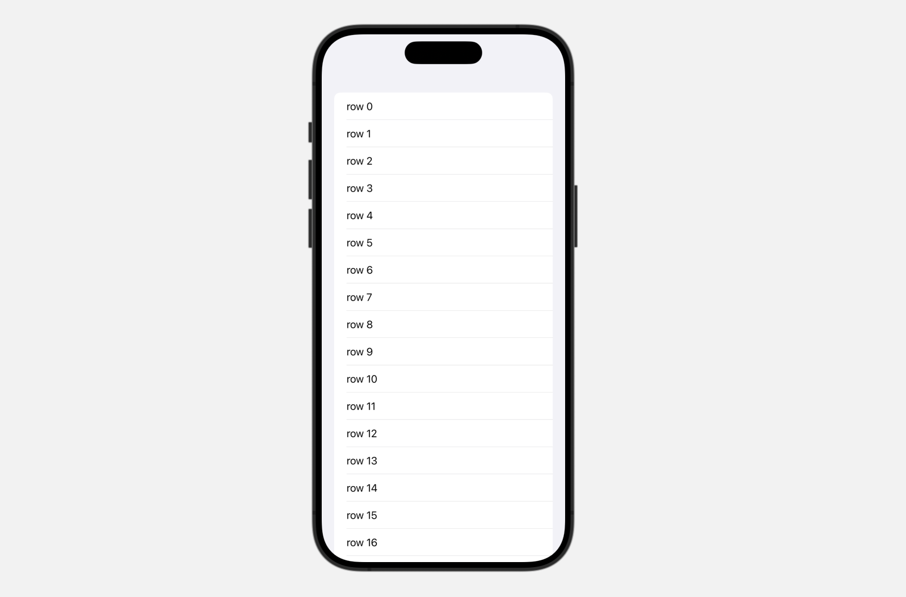
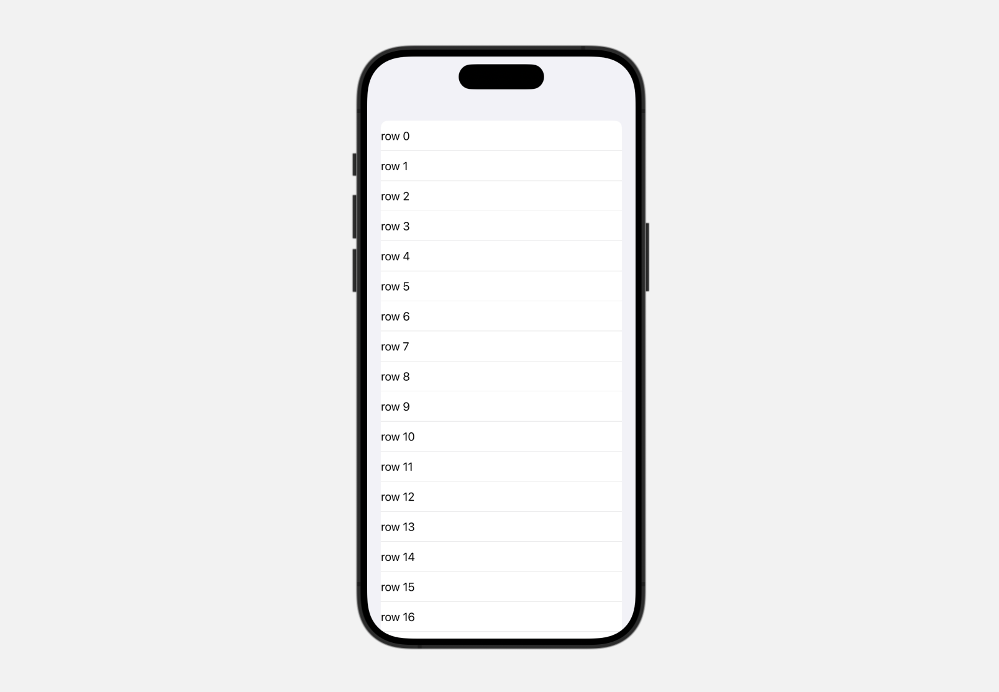
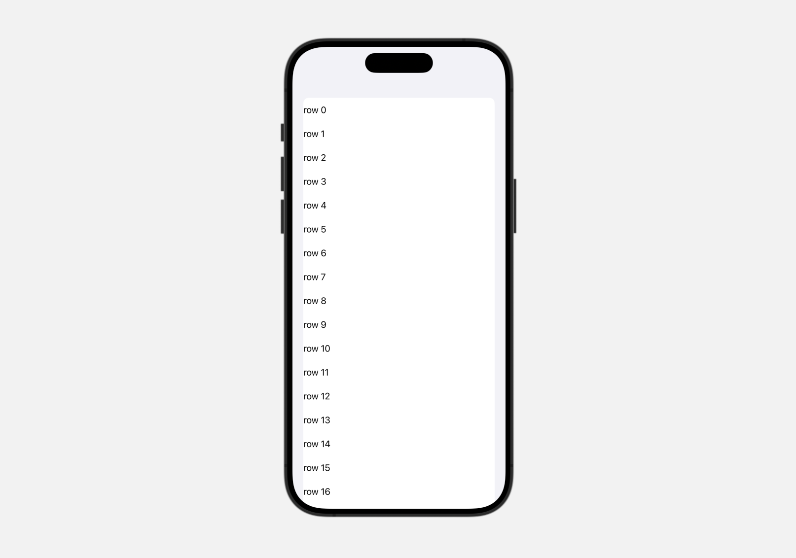
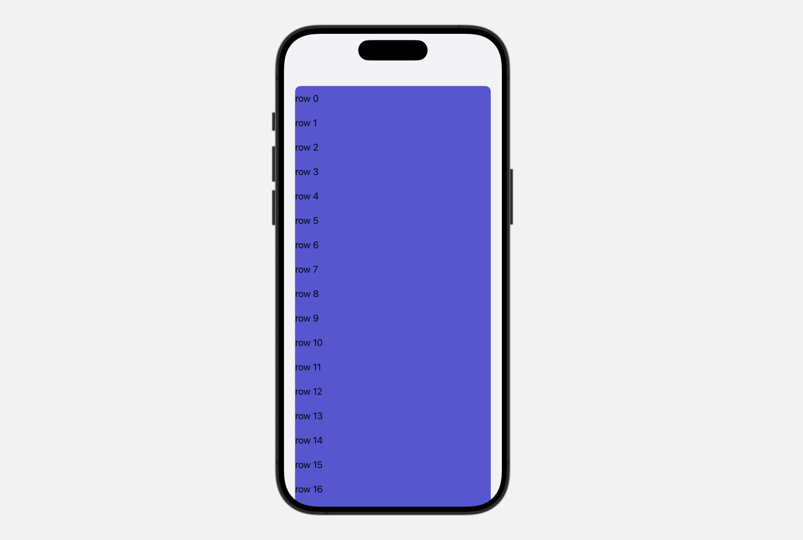
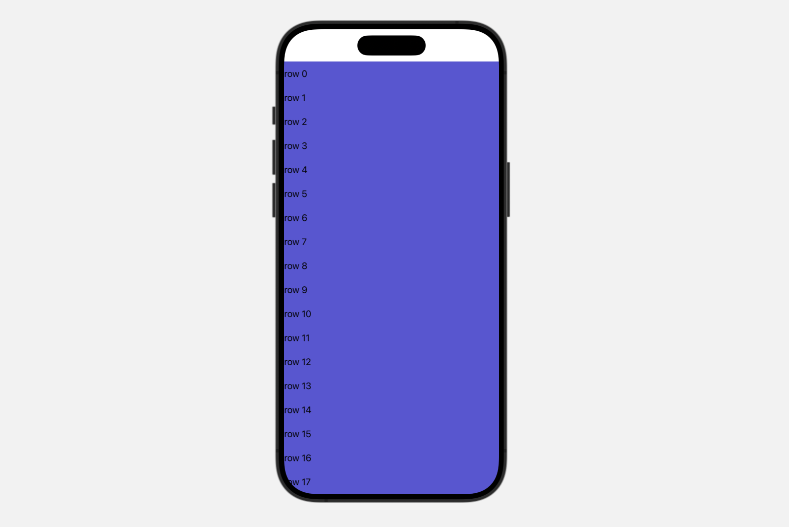

- SwiftUI의 뷰에는 디폴트 스타일이 적용돼있는 경우가 많다. 
- `List`에도 디폴트 스타일이 적용돼있는데, 커스텀 List를 만들땐 이 디폴트 스타일 제거가 필요하다. 
- List 디폴트 스타일 제거하는 방법을 알아본다.


## 디폴트 스타일이 적용된 List
- 50개의 row를 보여주는 List를 만든다. 
- 아무런 스타일이 추가되지 않은 디폴트 상태의 List이다. 
- 디폴트로 적용된 스타일은 아래와 같다.
1. List row 내부 padding. 
2. List row와 row 사이 separator. 
3. List row의 background color. (light mode일때 디폴트로 흰색)
4. List 주변 영역.
- 디폴트 스타일을 하나씩 제거해본다. 

```Swift
import SwiftUI

struct ContentView: View {
    @State var items = [String]()
    
    var body: some View {
        List(items, id: \.self) { item in
            Text(item)
        }
        .onAppear {
            for number in 0..<50 {
                items.append("row \(number)")
            }
        }
    }
}
```
<div class="articleImage" style="border-radius: 19px; overflow: hidden;">
    
</div>


## List 디폴트 스타일 제거하기
### 1. List row 내부 padding 제거하기
- List의 [`listRowInsets(_:)`](https://developer.apple.com/documentation/swiftui/view/listrowinsets(_:))를 사용해서 row 내부 padding을 모두 0으로 만든다. 
- List에 붙는 modifier이 아니고 List의 row에 붙는 modifier이다. 

```Swift
import SwiftUI

struct ContentView: View {
    @State var items = [String]()
    
    var body: some View {
        List(items, id: \.self) { item in
            Text(item)
                .listRowInsets(EdgeInsets(top: 0, leading: 0, bottom: 0, trailing: 0))  // highlight-line 
        }
        .onAppear {
            for number in 0..<50 {
                items.append("row \(number)")
            }
        }
    }
}
```

<div class="articleImage" style="border-radius: 19px; overflow: hidden;">
    
</div>

<br/>

### 2. row와 row 사이 separator 제거하기 
- List의 [`listRowSeparator(_:edges:)`](https://developer.apple.com/documentation/swiftui/view/listrowseparator(_:edges:))를 사용해서 separator의 visibility를 조정한다.
- 이것도 List에 붙는 modifier이 아니고 List의 row에 붙는 modifier이다. 
  
```Swift
import SwiftUI

struct ContentView: View {
    @State var items = [String]()
    
    var body: some View {
        List(items, id: \.self) { item in
            Text(item)
                .listRowInsets(EdgeInsets(top: 0, leading: 0, bottom: 0, trailing: 0))
                .listRowSeparator(.hidden)  // highlight-line 
        }
        .onAppear {
            for number in 0..<50 {
                items.append("row \(number)")
            }
        }
    }
}
```

<div class="articleImage" style="border-radius: 19px; overflow: hidden;">
    
</div>

<br/>

### 3. List row의 background color 제거하기
- List의  [`listRowBackground(_:)`](https://developer.apple.com/documentation/swiftui/view/listrowbackground(_:))를 사용해서 row의 background를 조정한다. 
- 파라미터로 넘기는 값은 꼭 `Color`뿐만 아니라 모든 `View`가 가능하다. 
- 아래 코드에서는 가장 간단하게 남색(indigo)을 지정해봤다.
  
```Swift
import SwiftUI

struct ContentView: View {
    @State var items = [String]()
    
    var body: some View {
        List(items, id: \.self) { item in
            Text(item)
                .listRowInsets(EdgeInsets(top: 0, leading: 0, bottom: 0, trailing: 0))
                .listRowSeparator(.hidden)
                .listRowBackground(Color.indigo)  // highlight-line 
        }
        .onAppear {
            for number in 0..<50 {
                items.append("row \(number)")
            }
        }
    }
}
```

<div class="articleImage" style="border-radius: 19px; overflow: hidden;">
    
</div>

<br/>

### 4. List 주변 영역 제거하기 
- 현재 남색의 List 주변에 그레이빛 영역이 있다. 이 영역을 제거하고 화면을 List로 꽉 채울 수 있다. 
- List의 [`listStyle(_:)`](https://developer.apple.com/documentation/swiftui/view/liststyle(_:))를 사용해서 리스트의 스타일을 조정한다. 
- `listStyle(_:)`는 row가 아닌 `List`에 붙는 modifier이다.
- 파라미터로 넣을 수 있는 값은 여러가지가 있는데, `.plain` style이 주변에 영역을 따로 안 주는 스타일이다.
```Swift
import SwiftUI

struct ContentView: View {
    @State var items = [String]()
    
    var body: some View {
        List(items, id: \.self) { item in
            Text(item)
                .listRowInsets(EdgeInsets(top: 0, leading: 0, bottom: 0, trailing: 0))
                .listRowSeparator(.hidden)
                .listRowBackground(Color.indigo)
        }
        .listStyle(.plain)  // highlight-line
        .onAppear {
            for number in 0..<50 {
                items.append("row \(number)")
            }
        }
    }
}
```

<div class="articleImage" style="border-radius: 19px; overflow: hidden;">
    
</div>


## List row의 디폴트 스타일 제거하는 view modifier
- List row의 디폴트 스타일 제거하는 작업을 자주한다면 아예 view modifier로 묶어서 편리하게 사용할 수 있다. 

```Swift
struct ResetRowStyle: ViewModifier {
    func body(content: Content) -> some View {
        content
            .listRowInsets(EdgeInsets(top: 0, leading: 0, bottom: 0, trailing: 0))
            .listRowSeparator(.hidden)
            .listRowBackground(Color.indigo)
    }
}

extension View {
    func resetRowStyle() -> some View {
        modifier(ResetRowStyle())
    }
}
```

- 사용은 아래와 같이 List의 row에 적용해주면 된다. 
```Swift
struct ContentView: View {
    @State var items = [String]()
    
    var body: some View {
        List(items, id: \.self) { item in
            Text(item)
                .resetRowStyle()
        }
        .listStyle(.plain)
        .onAppear {
            for number in 0..<50 {
                items.append("row \(number)")
            }
        }
    }
}
```