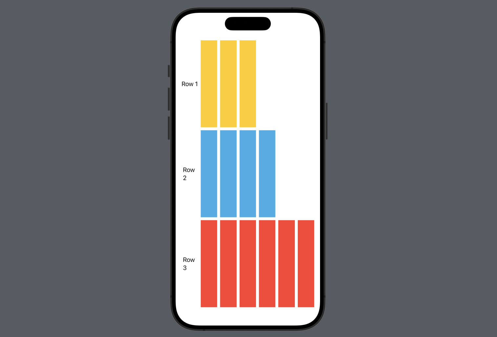
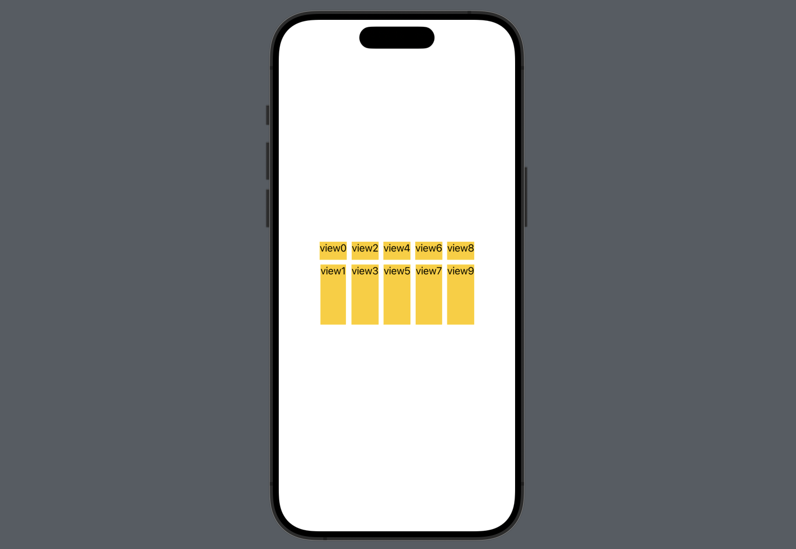
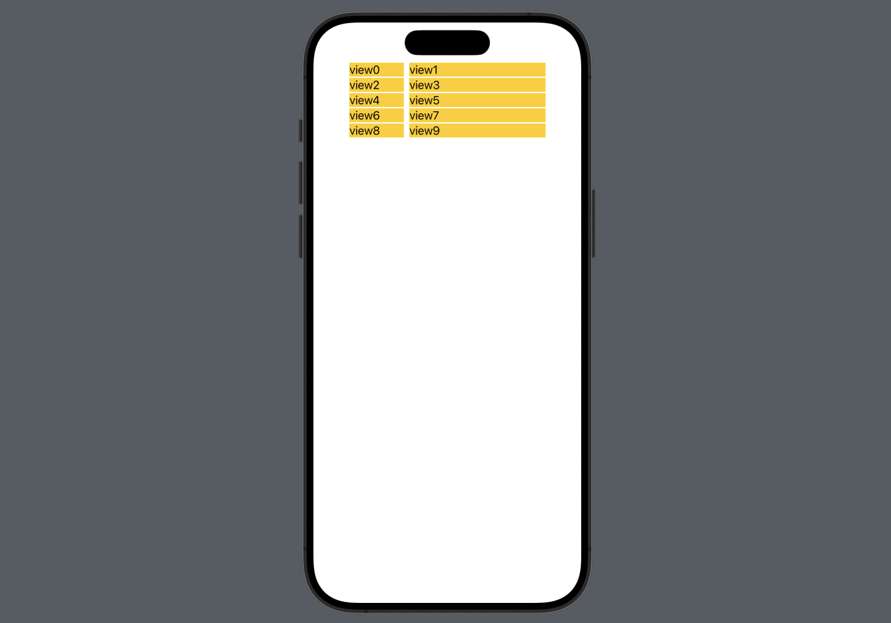

- SwiftUI의 `Grid`는 UIKit의 `CollectionView`와 비슷하게, 2차원 배열의 뷰를 그린다. 
- Grid를 그릴 수 있는 방법은 3가지가 있다.
    - `Grid`
    - `LazyHGrid`
    - `LazyVGrid` 
- 자신의 use case에서 가장 쉽게 구현이 가능한 view를 선택하면 된다. 

## Grid 
- `Grid` 안에 `GridRow`를 사용해서 각 row의 view를 정의한다. 
- 하나의 GridRow가 하나의 row다. 
- GridRow 내부의 view는 각각 column로 정의된다. 
```Swift
struct GridContent: View {
    var body: some View {
        Grid() {
            // First row
            GridRow {
                Text("Row 1")
                Color.yellow  // first column of first row
                Color.blue  // second column of first row
                Color.orange  // third column of first row
                Color.cyan  // fourth column of first row
            }

            // Second row 
            // GridRow {
            //     Text("Row 2")
            //     ...
            // }
        }
    }
}
```


- `GridRow` 내부 하나의 view의 **width**는 어떻게 정해지나요?
  - Grid width / n
    - n = 모든 GridRow 중 view 개수가 가장 많은 row의 view 개수 
- `GridRow` 내부 하나의 view의 **height**는 어떻게 정해지나요?
  - Grid height / m
    - m = GridRow 개수
  
```Swift
struct GridContent: View {
    var body: some View {
        Grid() {
            // First row
            GridRow {
                Text("Row 1")
                ForEach(0..<3) { _ in Color.yellow }
            }

            // Second row
            GridRow {
                Text("Row 2")
                ForEach(0..<4) { _ in Color.cyan }
            }

            // Third row
            GridRow {
                Text("Row 3")
                ForEach(0..<6) { _ in Color.red }
            }
        }
        .padding()
    }
}
```
<div class="articleImage" style="border-radius: 19px; overflow: hidden;">
    
</div>


## LazyHGrid
- `LazyHGrid`는 `rows`라는 `GridItem` array를 파라미터로 받아서 만들어진다. 
- rows의 **`GridItem` 개수**는 **row의 개수**를 의미한다. 
- rows의 각 **`GridItem`이 정의하는 사이즈**는 각 **row의 height**를 의미한다. 
    - `let rows = [GridItem(.fixed(30)), GridItem(.fixed(1000))]`
    - row 2줄이고, row 1 높이는 30, row 2 높이는 60이다. 
- `LazyHGrid`의 content에 있는 각 view를 배치하는 순서는: 
    - 왼쪽 위에서 시작해서, 정해진 row 개수만큼 채우고, 가로 방향으로 채워나간다. 
    - 아래 예시에서 view의 번호는 `LazyHGrid`가 각 view를 배치하는 순서를 나타낸다. 

```Swift
struct HorizontalGridView: View {
    let rows = [GridItem(.fixed(30)), GridItem(.fixed(100))]

    var body: some View {
        LazyHGrid(rows: rows) {
            ForEach(0..<10) { number in
                Text("view\(number)")
            }
        }
    }
}
```
<div class="articleImage" style="border-radius: 19px; overflow: hidden;">
    
</div>


## LazyVGrid
- `LazyVGrid`는 `columns`라는 `GridItem` array를 파라미터로 받아서 만들어진다. 
- columns의 **`GridItem` 개수**는 **column의 개수**를 의미한다. 
- columns의 각 **`GridItem`이 정의하는 사이즈**는 각 **column의 width**를 의미한다. 
    - `let columns = [GridItem(.fixed(80)), GridItem(.fixed(200))]`
    - columns가 2개고, column 1 width는 80, column 2 width는 200이다. 
- `LazyHGrid`의 content에 있는 각 view를 배치하는 순서는: 
    - 왼쪽 위에서 시작해서, 정해진 column 개수만큼 채우고, 아래 방향으로 채워나간다. 
    - 아래 예시에서 view의 번호는 `LazyHGrid`가 각 view를 배치하는 순서를 나타낸다. 

```Swift
struct VerticalGridView: View {
    let columns = [GridItem(.fixed(80)), GridItem(.fixed(200))]

    var body: some View {
         ScrollView {
             LazyVGrid(columns: columns) {
                 ForEach(0..<10) { number in
                     HStack{
                         Text("view\(number)")
                         Spacer()
                     }
                     .background(Color.yellow)
                         
                 }
             }
         }
    }
}
```
<div class="articleImage" style="border-radius: 19px; overflow: hidden;">
    
</div>