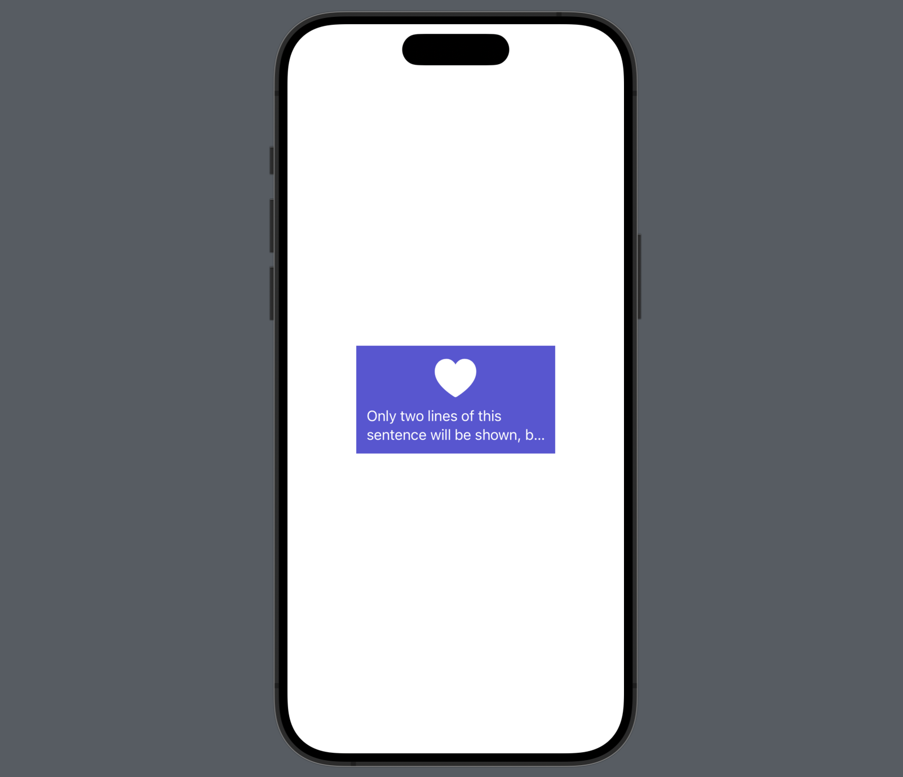

- SwiftUI `Text`의 최대 라인 수를 강제해야할 때가 있다.
- `Text`의 `.lineLimit(_:)` 함수를 사용하면 된다.
- 아래 같이 최대 2줄까지만 보이는 `Text`를 만들어본다. 
  - 2줄보다 적은 양의 문구라면 모든 문구가 보이고, 2줄을 넘어가면 2줄까지만 보이고 마지막은 `...` 으로 짤린다. 

<div class="articleImage" style="border-radius: 19px; overflow: hidden;">
    
</div>


```Swift
struct ContentView: View {
    var body: some View {
        VStack(spacing: 8) {
            Image(systemName: "heart.fill")
                .font(.system(size: 50))
                .foregroundColor(.white)
            Text("Only two lines of this sentence will be shown, but it is actually longer than that.")
                .lineLimit(2)
                .foregroundStyle(.white)
        }
        .padding(12)
        .background(Color.indigo)
        .padding(80)
    }
}
```