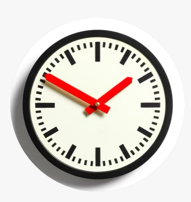
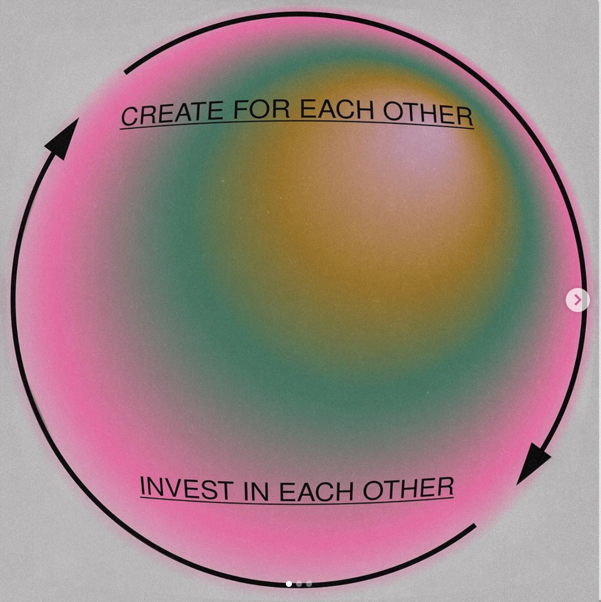

Do Pandas eat bananas? Check out this short video that shows that yes! pandas do seem to really enjoy bananas!
Visit the link [here](google.com).

<iframe width="560" height="315" src="https://www.youtube.com/embed/4SZl1r2O_bY" frameborder="0" allowfullscreen></iframe>

### Connecting Storyboard Element to Code

```javascript{numberLines: true}
// In your gatsby-config.js
plugins: [
  {
    resolve: `gatsby-transformer-remark`,
    options: {
      plugins: [
        `gatsby-remark-prismjs`,
      ]
    }
  }
]
```

```python{numberLines: true}
listA = [1, 2, 3]
for a in listA:
    print(a)
```

```swift{numberLines: true}
items.map{ $0 + " day" }
```


