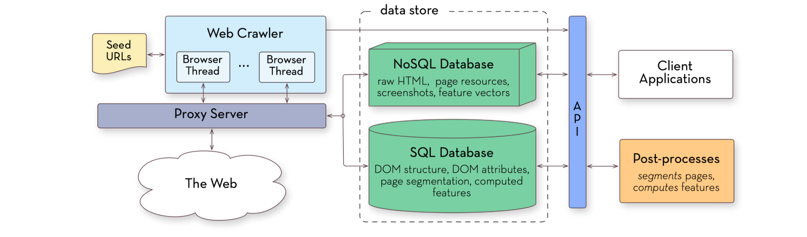
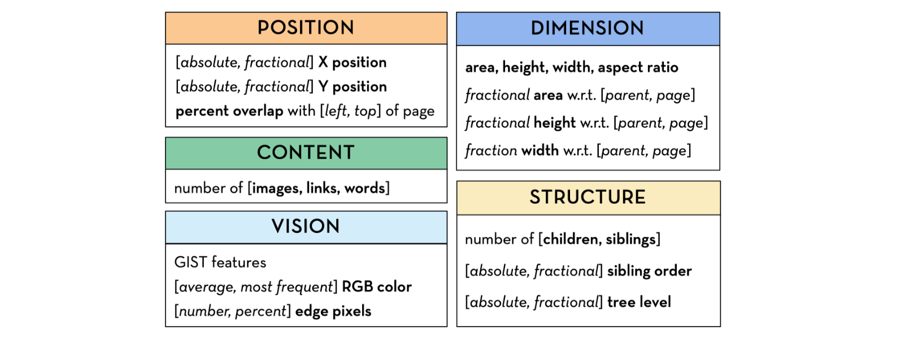

* This post is to summarize the paper [Webzeitgeist: Design Mining the Web](http://citeseerx.ist.psu.edu/viewdoc/download?doi=10.1.1.359.8964&rep=rep1&type=pdf).
* Not covering the specifics, this post looks over the big chunks of idea.
  
** &nbsp;*figures used on this post are from the original paper*

## Design Mining & Webzeitgeist
**Design Mining**
* understand design demographics
* automate design curation
* support data-driven design tools

**Webzeitgeist**
* large scale design mining
* a repository of over 100,000 web pages

## Paper Outline
* Principles driving design mining (← this part is skipped on this post)
* Implementation of Webzeitgeist architecture
* Examples of Webzeitgeist application

## Webzeitgeist Architecture

#### Overall Implementation Architecture 
* five integrated components: the Web crawler, the proxy server, the data store, the post-process, and the API.
 

* only post-process component is summarized in detail on this post. 

#### Feature Post-Process
* once a page has been downloaded, converted to a DOM, rendered, and stored,
* a set of post-processes are run on it.
	* ① &nbsp;computes a visual hierarchy from the DOM
		* discarding nodes that do not contribute to the page’s rendered appearance
		* re-parenting nodes to ensure that parent-child relationships in the hierarchy correspond to visual containment on the page
	* ② &nbsp;computes a set of semantic and computer vision features over each element in the hierarchy & stores them
		* result: 
		
	* ③ &nbsp;coalesces each node’s visual, semantic, and render-time features into a **vector descriptor**  → exposes page properties in a convenient form for design mining applications.
	* ④ &nbsp;each page node is associated with a 1679 dimensional descriptor
		* 691 render-time HTML and CSS properties computed by the DOM, 
		* 960 GIST scene descriptors computed on the node’s rendering, 
		* 28 structural and computer vision properties.
	* ⑤ &nbsp;restructures the table where DOM properties are stored.
		* for reducing retrieval time
		* uses *star schema*

## Webzeitgeist Application examples
#### 1. Classification
* used as a backend to train structural semantic classifiers.
* concrete example can be found from [this paper](https://lookdeceline.github.io/blog/Learning-Structural-Semantics-for-the-Web).

#### 2. Metric Learning
* metric learning: task of learning a distance function over objects ([reference](http://contrib.scikit-learn.org/metric-learn/introduction.html))
* uses [OASIS](https://ai.stanford.edu/~gal/Research/OASIS/).
    * input: set of identically labeled page elements 
    * attempts to learn a symmetric positive-definitive matrix that minimizes inter-set distances
    * used to perform query-by-example searches on page regions via a nearest neighbor search in the metric space.
    * example search using metric learning:
    