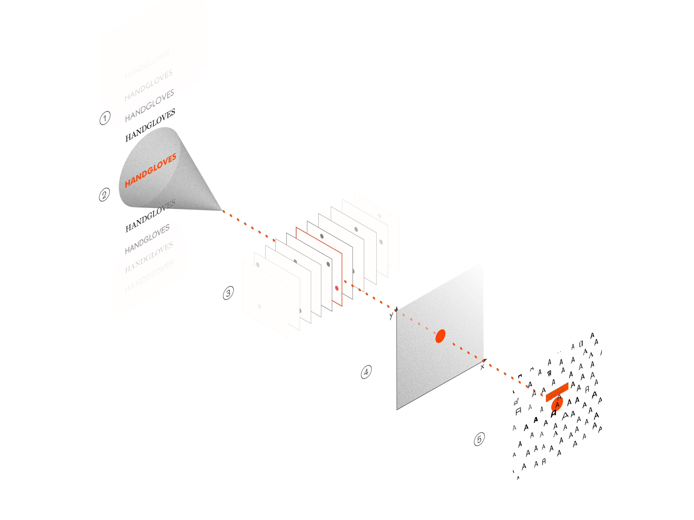
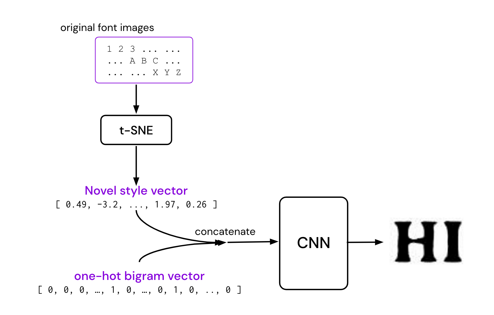
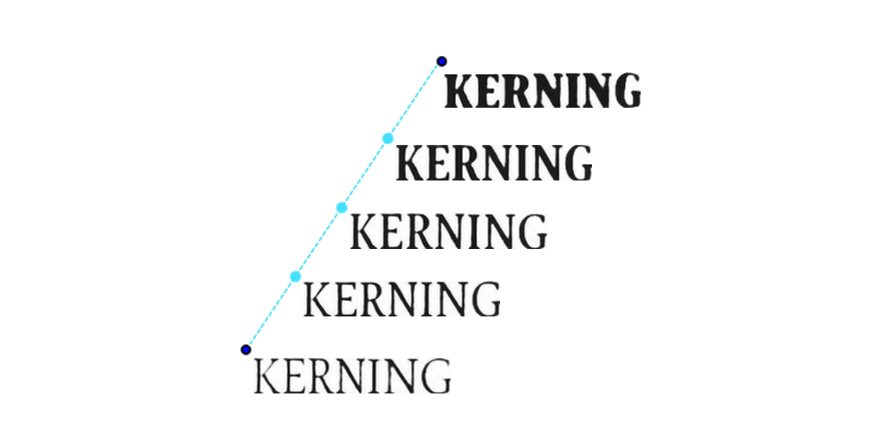
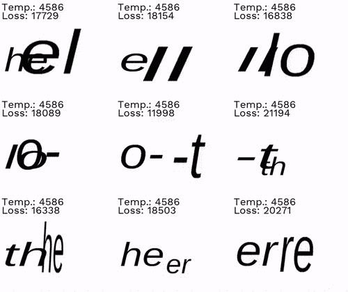

## i. Motivation
My brother writes his [developer's blog](https://www.hohyeonmoon.com/) in Korean. But often, he writes certain terminologies in English. 
An important part of a blog aesthetic is the font. While there are few hundreds of free English fonts, there aren't that many available in Korean.
So he had to spend hours finding the right Korean and English fonts that were available for free, but also look good enough together. 

Creating a new font is an absolute pita. Even more so for Asian characters that have more character numbers. 
Korean has 40 characters, and a Korean *word* is a combination of at least 2 characters. 
With [kerning](https://type.method.ac/) included, the font design process requires hard manual work on each pixel. 

What if font styles could be transferred from one language to another? 

In search of **a neural network that can properly create new fonts**, this series will have three different posts: 

 

**1.  Naive approach**  exploring font space with deep learning methods such as VGG16 and T-SNE. 

**2.  Advanced approach**  exploring font space with deep learning methods such as autoencoder, VAE, and GAN.

**3.  Future works**  personal projects.

 

****** *This post (post 1) covers part 1. Posts 2, 3 are soon to be uploaded*.

## Exploring font space using CNN & T-SNE
There have been two interesting projects that have attempted to :

**a)** visualize distribution of similar font types in clusters using VGG16 & T-SNE

**b)** create new fonts by training using CNN & T-SNE  

## ii. Visualizing font space
Two separate projects - one by Kevin Ho, another by Jack Qiao - have wondefully visualized various fonts on a low dimensional (2D or 3D) space map. 
Both projects leveraged VGG16 to extract feature vectors off font images. Then, both ran the extracted feature embeddings through T-SNE.

 

*disclosure: this part of the post has been inspired by Kevin Ho's [original post](https://medium.com/ideo-stories/organizing-the-world-of-fonts-with-ai-7d9e49ff2b25) 
& Jack Qiao's [github repo](https://github.com/Jack000/fontjoy).*

### 1) implementation steps

>>>>> [figure source](https://medium.com/ideo-stories/organizing-the-world-of-fonts-with-ai-7d9e49ff2b25)
1. Dataset:  Create a 'Handgloves' image for each font. (about 800 fonts in total, so that would make about 800 different 'Handgloves' images)
2. Extract feature vector:  For each font image, run through VGG16 Convolutional Neural Network to get a feature embedding. 
3. Visualize:  Run all feature vectors through T-SNE to visualize their distributions over a 2-D plane. 

Visualization results can be viewed here:

[Kevin Ho (IDEO)](http://fontmap.ideo.com/)

[Jack Qiao](https://fontjoy.com/projector/)

### 2) applications 
Both projects are applied to a design aid to help designers make easier font choice. Designers can look up [IDEO's font map](http://fontmap.ideo.com/), or Jack Qiao's web app [fontjoy.com](http://fontjoy.com) to find out which font pairings would go well together.

## iii. Creating new fonts
A project by Patrick Gadd attempts to create proportional fonts with a neural network.
What is unique about this project is that it creates proportioanl fonts. Proportional font is a font that also has [kernings](https://en.wikipedia.org/wiki/Kerning) included in its design. 

 

*disclosure: This part of the post has been inspired by [this blog post](https://patrickgadd.github.io/feel-the-kern/) & corresponding [github repo](https://github.com/patrickgadd/feel-the-kern).*

### 1) implementation steps 

1. Encode novel font styles using t-SNE:  Map the fonts you have to z-dimensional vectors expressing their "style".
	* Dimensionality space **z** is a continuous space where we can interpolate between the original fonts.
	* Thus, this will allow us to create a continuum of fonts which are novel combinations of the original fonts, like below: ([figure source](https://patrickgadd.github.io/feel-the-kern/)) 
	
	* This project chose z = 10. This would create a 10-dimensional style vector.
		- The 10-dimensional style-vector is simply the point in the space Z which t-SNE told me corresponds to the given font.

2. Encode bigram:  create a one-hot encoding of bigrams.
	- A bigram of an alphabet that writes `ET`would look like something like this:
	
	`00001000 00000000 00000000 000	`
 
	`00000000 00000000 00010000 000`
	- Why encode it as one-hot vector?  Because we want each alphabet encoding to have no correlation to another.
3. Concat ( style encoding + bigram encoding ) into a single vector & Train a CNN (convolutional neural network) that takes a concatenated input vector, and outputs the corresponding bigram feature vector.
	* input size: 64 = 10-dimensional z + 54-dimensional one-hot encoding 
		* 54-dimension: comes from the bigram encoding. (26 uppercase alphabet + 1 hyphen symbol) * 2, since it's bigram.
		* 10-dimension: comes from the t-SNE style vector. 
	* output size: 41 by 65 pixel images generated from 1,639 fonts, with all 27*27 combinations of the two characters in the bigrams.
	* the model is trained by having it produce an estimated ỹ from x. ỹ is then subtracted from the expected image, y, 
	and the mean absolute error is then used to update the model such that it produces a ỹ closer to y.
	
	📌 At this point we can create bigrams in a continuum of styles. i.e. a model is now capable of producing bigrams.
4. Overlap bigrams to complete full words:  Generate bigrams of new styles, and use simulated annealing to overlap the bigrams to full words.
	* We have only created bigrams of 27 * 27 combinations. If we were to write "HELLO" with a new font, we would have to stich each bigrams “HE”, “EL”, “LL”, “LO”  into one word "HELLO"
	by overlaying bigrams onto one another.
	<!---->

## iv. Review & Possible improvements
1. (improvement regarding ii) When creating new font styles, perhaps t-SNE can be replaced with an autoencoder/ variational autoencoder. 
2. (question regarding ii) CNNs are often used for classification tasks or for extracting feature vectors. What is the role of CNN in this particular model?
3. (review regarding ii) Do other methods take kerning into design consideration?

<!-- 
series into 3 parts - intro 
1. VGG
2. feel the kern 무슨 nn?
3. auto encoder
4. vae, gan 
5. future 1 :  style transfer :  english fonts to korean  using cycle gan??? 
	then what is cycle gan ??? where is it used?
	what other ways are there to trasfer style?
6. future 2 : new fonts dataset -- only containing fonts with legit characters 
	- google fonts
	- behance free fonts 
	- ==> train with these fonts and see if the nn creates fonts that look like ones that arent free (ex. apercu)
7. future 3:  
-->

