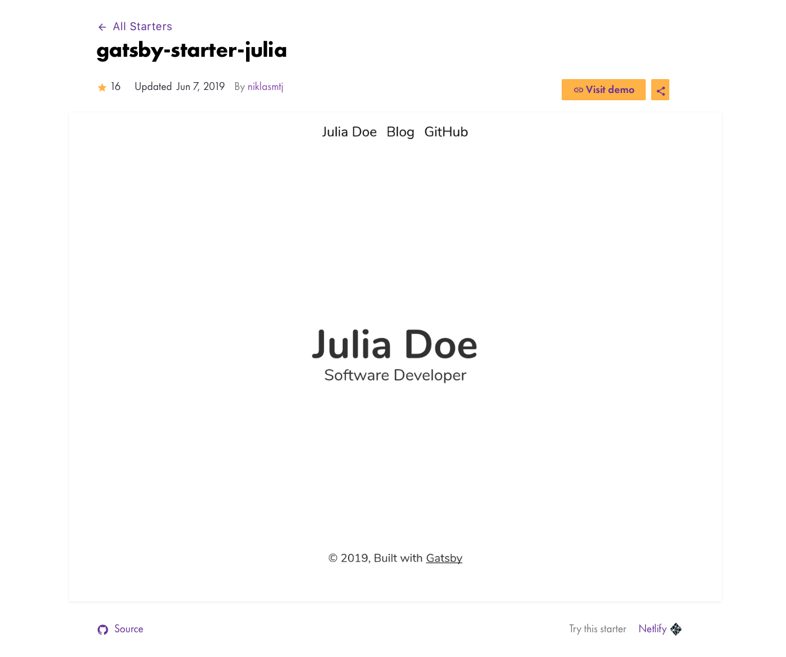

## Step by Step Guide
This guide builds a static blog on [Github Pages](https://pages.github.com) with Gatsby on MacOS. The official documentation on getting started with Github Pages is for pages written with Jekyll. You may skip some of the steps depending on your needs.

This guide also assumes you already have a github account. If you don't, please set up set one up on [Github](github.com).

## Why Gatsby
Github Pages officially recommends using Jekyll. Jekyll is a ruby-based static site generator. Its founder also happens to be the co-founder of Github and perhaps that's why Github officially recommends using Jekyll. It is true that there are various pre-made Jekyll themes, and communities for setting up blogs using Jekyll are quite popular. However, I prefer using react.js, which is why I chose Gatsby. 

### 1. Create your blog repository on your Github account
Go to your github profile, and create a new repository for your blog. You have to name your repository the same as your Github account name. 

### 2. Install nodejs
### 2-1. install homebrew on your Macos
Once you have created a new repo, make sure you have homebrew installed in your MacOS. If you don't have one already, simply install one. 
On your Terminal application, type in the following command and hit enter: 
`/usr/bin/ruby -e "$(curl -fsSL https://raw.githubusercontent.com/Homebrew/install/master/install)"` 
Confirm that homebrew is installed fine with the command `brew help`.

### 2-2. install Node.js & NPM 
Now install Node.js and NPM:  `brew install node` 
Confirm both are installed: 
`node -v` 
`npm -v` 
Each should show the version that is installed in your MacOS.

### 3. Select Gatsby starter
Gatsby offers pre-made [starters](https://www.gatsbyjs.org/starters/?v=2). You can choose any one of these starters in Gatsby starter library. Each starter theme has a linked Github source as shown below. You can find the below starter [here](https://www.gatsbyjs.org/starters/niklasmtj/gatsby-starter-julia/).

Click on it and check out the Readme markdown. That is where the detailed explanation on how to set up app for React using Gatsby CLI.

### 4. Testing out on your local server (before pushing to Github Pages)
Once you have set up your blog app, you are now set to demo it. Before officially pushing your newly created blog to Github Pages by "pushing" it to the remote repo, you can test it out on your local server. This is a smart way to confirm to yourself that everything is working as it is supposed to, before making it go live, available for everyone else to see.

Simply use the command `gatsby develop`. This runs your blog on your local server port number 8000. 
Now go on to your internet browser, and type in 'localhost:8000' and see what your blog actually looks like. 

If you want to stop running it on your local server, simply quit by `ctrl c` on your terminal.

### 5. Push Github app to Github Pages
The easiest way to push a Gatsby app to GitHub Pages is by using a package called gh-pages.
The rest of the steps are well documented on the official [Gatsby page](https://www.gatsbyjs.org/docs/how-gatsby-works-with-github-pages/).

