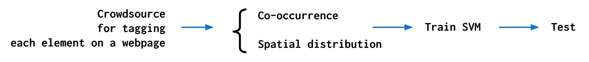
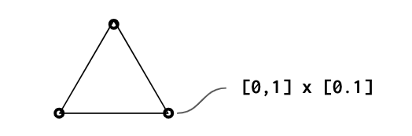

This post is to summarize points / concepts / conclusions to be noted 
from / while reading the following technical report: [Learning Structural Semantics for the Web](https://hci.stanford.edu/cstr/reports/2012-03.pdf).

## What is Semantic Web?
* The Web has had 3 different versions.
    * Web 1.0 
    The basic HTML document that started out at CERN, and only acted as data presenter.
    * Web 2.0 
    Interactive Web with technologies like AJAX and RSS.
    This is the Web we use today.
    * Web 3.0 
        * **Semantic Web** is often used as synonym for Web 3.0. Tim Berners-Lee described Semantic Web as a component of Web 3.0. 
        * Semantic Web ultimately makes **machine** understand Internet data. 
        * With Semantic Web, internet describes concepts, relationships between things, and categories of things.
          
        * ***note:* Web 3.0** is a movement away from the centralization of services like search, social media 
        that are dependent on a single organization to function.

## Where did Semantic Web go?
* It's not here yet. 
* This paper attempts to semantify a webpage by using SVM classifier 
that identifies an element of a webpage as a structural semantic tag.

## Methodology

* Used online crowdsource workers (Amazon Mechanical Turk) to assign each element of a webpage to a semantic tag.
* Measured co-occurrence & spatial distribution to assess semantic structural hierarchy.
    * Label Co-occurrence
        * matrix size 85 x 85
        * for 85 most frequent labels (freq>=20)
        * different workers may assign different descriptors to label same concept.
        * heavy concentration of high-opacity cells along diagonal <=> strong clusters of co-occurrence.
    
    * Spatial Distributions
         

* Train SVM classifier
* Test 

## Results
* Structurally more consistent elements showed better prediction results. (ex. footer)
* Errant classifications usually happen on elements that are subtle, plausibly confusing for even a human worker.
* Even when the classifiers are trained only on visual and structural data, but expressive enough.
* Hence, structural semantics can be learned without requiring content-based semantics.
