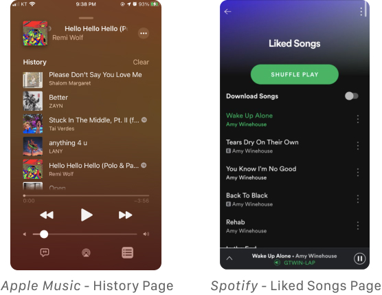
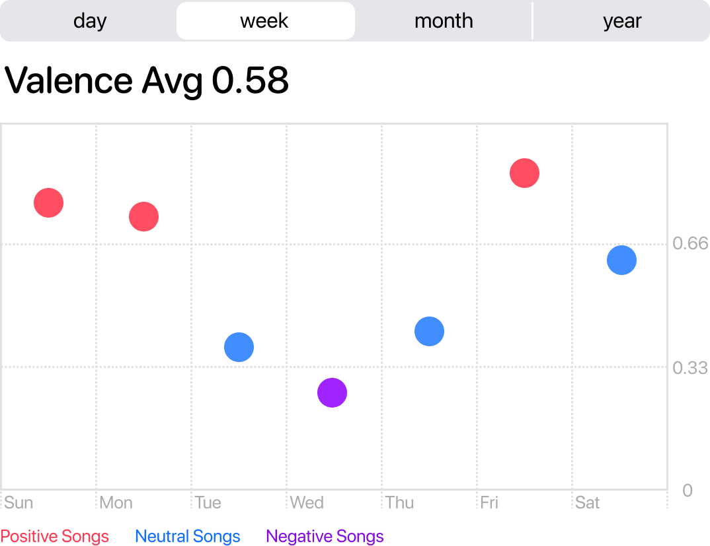
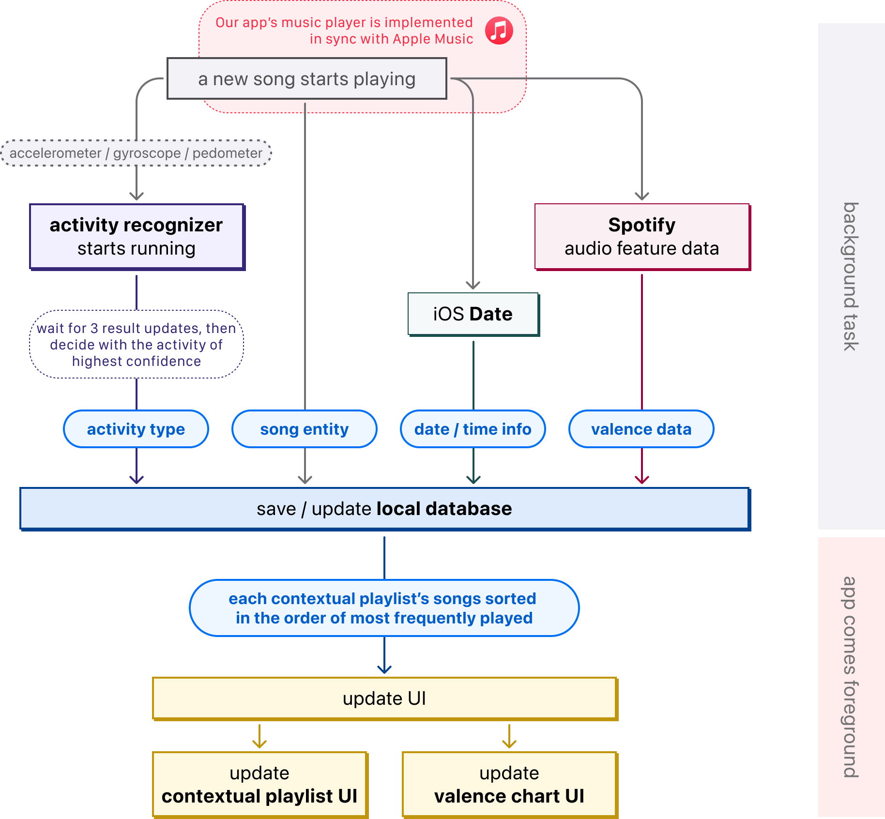
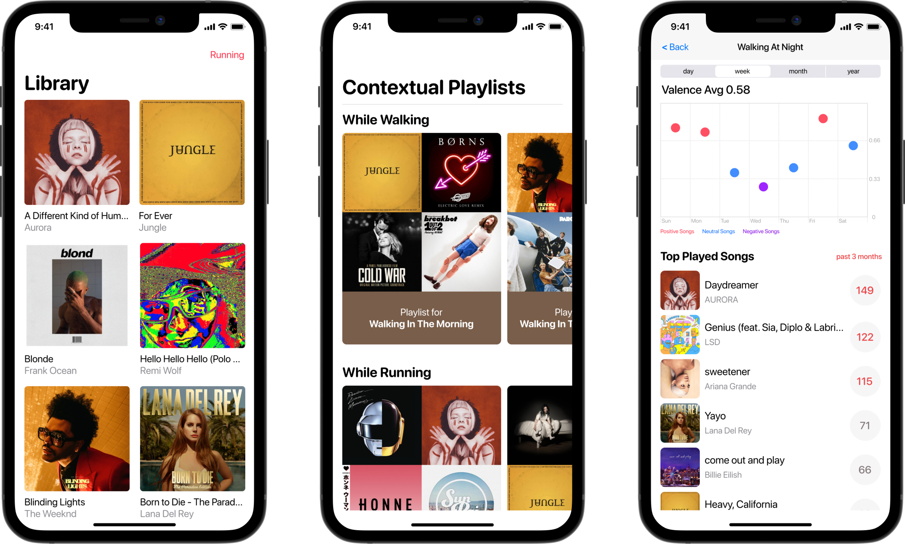
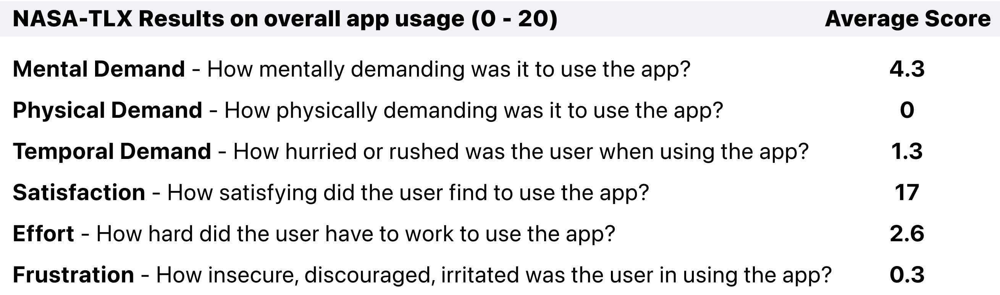
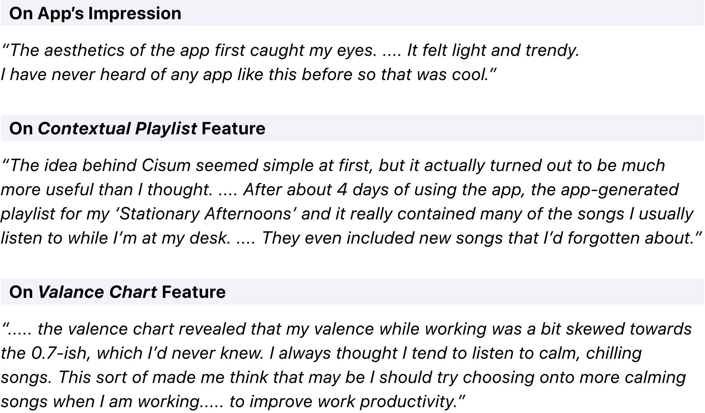

### About The Project
---
As a term project for Mobile Computing and Its Applications course, my teammate and I designed and implemented a novel music streaming app that provides personal insight in music listening pattern, by tracking users’ song selection and user context information. I designed UX and UI, and implemented the client side (iOS) of the app. 

### Project Context
---
#### What Is Cisum?
Cisum is a mobile music streaming app that provides personal insight in music listening pattern, by tracking users’ song selection and user context information. A user context can be decomposed into two dimensions: time and activity type. What time of day it is and what the user is doing both affect users’ music choice. 

Cisum provides the following insights on users’ music listening pattern:
* Most frequently played tracks under different contexts.
 e.g. What songs do I play the most when I’m walking at night?
* Whether users tend to listen to more positive or more negative songs under different contexts.
 e.g. Does the user generally play sad, dark songs or happy, bright songs when the user is walking at night?

The name Cisum is ‘music’ spelled backwards.

#### Project Motivation
There are many music services that provide music recommendation. However, users aren’t provided with a well organized, insightful list of their previously listened records. Existing music apps do provide a list of listening history or user-liked songs; however this list tends to get too long for a user to scroll all the way back, and is not easy to find a particular song from the messy, unorganized list. 

    

To provide users with more insightful music tracking, my team and I designed a music app that contextually tracks the songs a user listened to, and compiles a playlist for each context. 

### Challenges
---
#### User Context & Music Selection
As demonstrated in various works in the literature([1], [2], [3]), a set of songs that a user selects to listen to is heavily dependent on the user’s current context. We can easily find such use cases from Youtube. There are thousands of playlists that are catered to particular contexts, such as “A playlist for walking in the rain”. Users are already well aware how different contexts trigger different emotions, and hence affect users’ music choices. 

In an effort to provide a fine-grained, organized list of listening history, we decided to group songs based on user’s context in which the user listened the songs to. In doing so, we defined a user context to be a combination of two factors: the time of the day, and the user’s activity type. 

This creates a total of 12 (= 3 x 4) different combinations of user context:
* There are 3 different time phases of the day: morning, daytime, night
* There are 4 different types of activities: walking, running, driving, stationary

For example, the user context recognized at night when the user is walking is called “walking at night”.

For each of user context, we count the number of times each song is played. The system is then able to automatically compile a playlist of most frequently played songs under different contexts. 

#### Valence & Emotions
In addition, for each user context, we designed to visualize the valence of songs that the user listens to through a chart. This provides a visual quantified insight about self.

Valence measures from 0.0 to 1.0, describing the musical positiveness conveyed by a track. Tracks with high valence sound more positive (e.g. happy, cheerful, euphoric), while tracks with low valence sound more negative (e.g. sad, depressed, angry) [4].

    

For instance, this chart is a valence chart for walking-at-night playlist. We can see that this user tends to listen to low valence songs while walking at night. (y-axis = valence of each song)

This insight could be helpful for the user. For example, if the user wished to become more productive or feel more energized in the evenings, the user could try to listen to more cheerful, energetic songs. 

<!-- `video: https://www.youtube.com/embed/2Xc9gXyf2G4` -->

### System Design and Architecture
---
#### Creating Music Player
In order to track all songs a user starts playing, we embedded Apple Music inside our app. Users can play, like, save, download songs in sync with their Apple Music account.  

#### Tracking User Context
To track time and user activity every time a new song is played, our app leverages the embedded sensors inside iPhone 8. These sensors include accelerometer, gyroscope, pedometer, and microphone. Processed and inferenced using iOS Core Motion framework, we were able to infer 4 different types of activities: walking, running, driving, and staying stationary. 

#### Getting Valence Data for Each Song
We get the valence data through an API request to the Spotify server. Spotify provides audio feature API, which includes valence value. 

#### System Architecture
This is a figure that represents the system architecture of Cisum. The background tasks are triggered when the next song starts to play.
This is possible since iOS allows background tasks when a song is playing.

    

### Final Output
---

    

The below are the descriptions of each app page. From the left to the right:
#### 1. Library Page
The Library Page is the music player page. It is implemented in sync with the official Apple Music service, so that users can easily play music inside Cisum, just like any other music streaming services. 
At the top right, if a music is playing, the user’s currently recognized activity is indicated. 

#### 2. Contextual Playlist Page
The Contextual Playlist Page is where users’ contextually collected music records are presented to the user. 
There are total of 4 sections, each section representing Walking, Running, Driving, and Stationary. 
Each section has 3 itmes, each representing Morning, Afternoon, and Evening.
Users can choose any one of thses contextually compiled playlists to play the playlist inside Cisum.

#### 3. Playlist Detail Page
If the user taps on one of the contextual playlists from the previous page, the tapped playlist’s Detail Page is opened.
A Detail Page shows the Valence Chart and Top Played Songs of the selected context. 
This figure is an exmaple page of Detail Page for Walking-At-Night context.

### User Evaluation and Interview
---
#### User Evaluation
We have conducted a user testing to find out how usable, insightful, or comfortable the app was for users. For 3 participants, we released a beta version of the app.
We used the NASA-TLX metrics to measure the usability of Cisum.
The below figure shows the average result:

    

According to the results, Cisum was easy to use, causing minimal frustration or effort on the users’ end. Users found the app to be highly satisfactory (17/20). 

#### User Interview
To get a qualitative evaluation of Cisum, we also conducted a user interview with one of the participants.

The below are sentences extracted from the user interview. 

    

