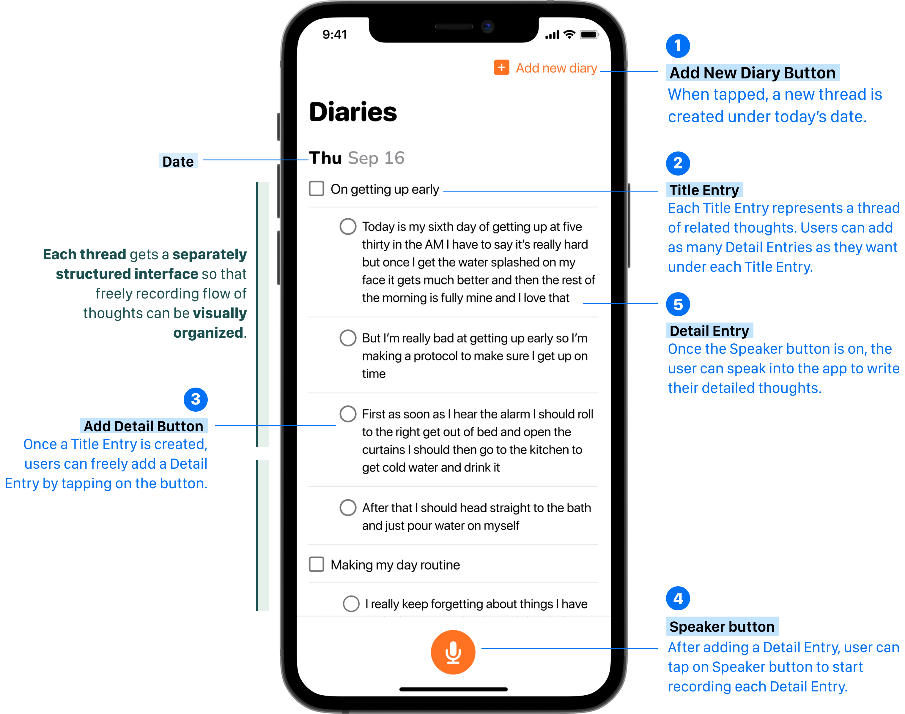
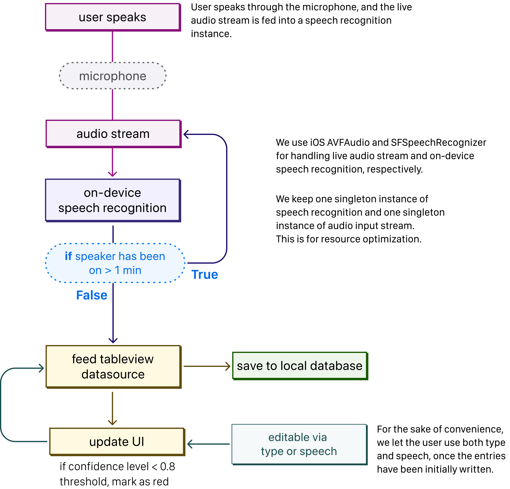

### About This Project
---
As a personal project, I made a diary app using speech recognition.
There are many hand interaction-based diaries: either via typing or by physically writing with a digital pen. However, there are no apps dedicated to writing diaries solely by voice. Voice Diarist lets users use speech as prime means in writing diaries, and provides a visually structured interface to keep the diaries organized. 

### Project Context
---
#### What is Diarist?
Voice Diarist is a mobile diary app you write with your voice.
Instead of having to type in the texts or write with a digital pen (e.g. Apple Pencil), you simply 
speak to the app to write your diary.

#### Project Motivation
Voice Diarist is a mobile diary app you write with your voice.
Instead of having to type in the texts or write with a digital pen (e.g. Apple Pencil), you simply 
speak to the app to write your diary.

### Challenge
---
#### Preliminary User Study
I conducted a preliminary user study to identify the pain points of digital diarists - users who 
regularly keep diaries on digital devices, such as smartphones or tablets. A qualitative user study 
revealed the following:

* Pain Point 1 The position in which users write diaries is not comfortable.
    * user A) “I want to write my diary at the end of the day in my most comfortable position. Like 
write while rolling around in bed, maybe.”
    * user B) “I usually type in my diary app on my iPhone while in my bed, but my arms ache after a 
while, cause I have to hold them up high in the air if I want ro type fast.”
    * user C) “/ like to write with my iPad, but that also means I have to be sitting at my desk to do 
it. Sometimes keep my diary See/s like another set of /a6or.”

* Pain Point 2 The length of diaries and the visual interface of diaries app often makes long 
writings become messy.
    * user D) “Keeping diary lets me record the flow of my thoughts, but at the same time it‘s tough to 
keep fhe records organ/zed. Like when I want to look back through what I wrote, I remember writing 
something down, but I can't find where I wrote it. It's a real bummer.”

#### Key Insights For UX Design
From the preliminary user study, I could notice that users wanted a way to write in a more 
comfortable position. They also wanted to easily write down their thoughts, but in a way that keeps 
them visually organized.

As a solution, I integrated voice interaction as a replacement to typing a keyboard or wrtiting 
with a digital pen. To keep the user interface appear visually organized, I created a diary list in 
a thread-like format that manages the structure of writings to stay sorted out.

In a nutshell, I designed the app to provide a structured interface that users can write into by 
speaking into the app.

### User Interface Design
---

    

### System Architecture
---

    

### Final Output, Lessons
---
#### Design Lessons
Speech-to-text interactions have become readily accessible for both developers and end-users, but it still falls short of human-level dictation. Furthermore, there still remain critical challenges to user experience that cannot be solely handled with STT gadget, such as detecting and writing down the punctuation marks from human speech.

#### Technical Lessons
One of the technical challenges in implementing speech recognition for an app was handling failures caused by resource limitations. Due to iOS resource limitations, by default, each session of a speaker instance can stay alive for only a minute at max. Because users can and most likely will sometimes leave the recording session on for more than a minute, it was important to take the system-level limitation into consideration to guarantee continuous and intuitive user experience.

#### Implications For Future Wearables

This project was a way to actualize the idea of leveraging speech interactions to explore users' private thoughts. Current speech interactions mostly involve looking up facts. However, I believe that speech interactions can also benefit users as a reflective way to record their thoughts, since when speaking out, users hear their own thoughts through their voice, instead of only keeping them quiet inside their minds. 
