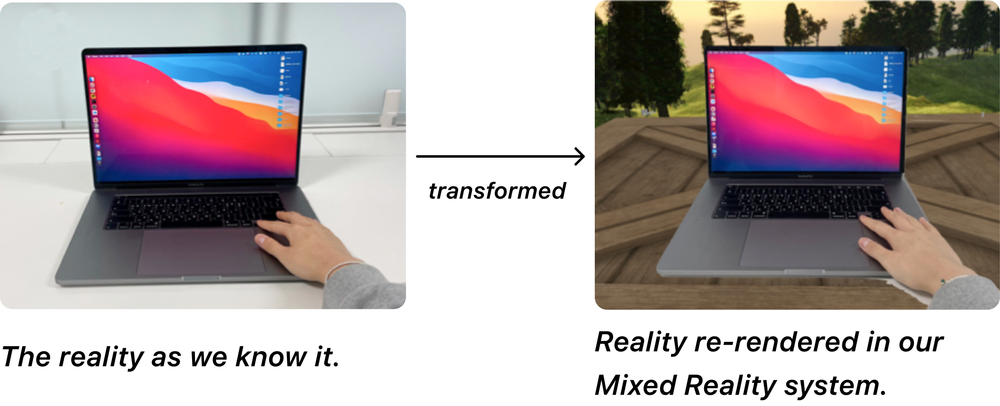
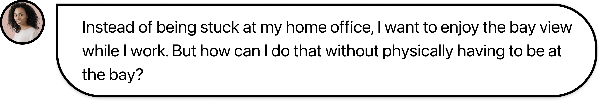
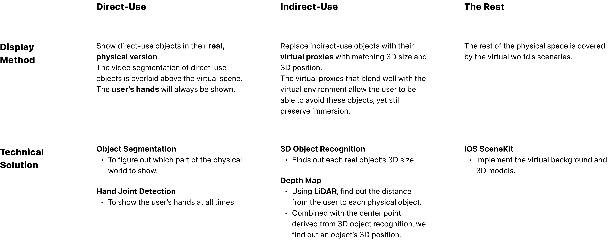
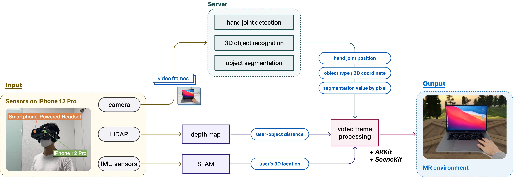

### About This Research
---
While I worked at Human-centered Computer Systems lab at Seoul National University as a research intern, I took a leading role in a Mixed Reality Research. Our team designed and implemented a novel Mixed Reality system that adaptively blends real-life objects into the virtual environment, thereby allowing users to freely perform daily tasks inside the virtual world.

### Project Context
---

 

#### What is Mixed Reality Research?
A novel Mixed Reality system with a smartphone-based AR headset to adaptively blend real-life objects into the virtual environment, such that a user can freely perform daily tasks inside the virtual world.

    

#### Research Motivation
The research began with a single question:
How to make dull daily activities more delightful with Virtual Reality?

    

What if in a virtual world, we could still see and use the physical objects we use in reality?
Why don't we re-render the reality so that we selectively see what we need and the rest is replaced 
with virtual world?

### Challenge
---
The main design challenge lies in maintaining the right balance between immersion and utility.
 a.k.a. To Show Or Not To Show

* **immersion** = how immersive is the virtual world experience?
* **utility** = how easily can the user carry out daily tasks in the virtual world, such as sending an 
email?

#### Key Insights To Balancing Between Utility and Immersion

Likewise, different objects have different need for utility or immersion, depending on how much 
directly the user intends to interact with the object.

Not all objects in the virtual world should be virtually rendered.
* E.g., the user's laptop should be rendered in its real physical appearance, , so that the user can send an email for 
real, even in the virtual environment.

Nonetheless, other objects / space should be virtually replaced for the sake of immersiveness of 
the virtual environment.

#### The Utility-Immersion Spectrum

Thus, depending on the interaction property, we identified three different groups of the physical 
surrounding, each requiring a different amount of utility vs amount of immersion. They can be 
visualized on the spectrum of utility-immersion.

    

* **direct-use**
real objects that the user needs to use directly.
For this group of objects, the need for utility trumps the need for immersion,
as the user requires fine-grained knowledge of the objects to directly use them. 
 e.g., the user's laptop

* **indirect-use**
real objects that the user should be aware of in order to avoid bumping.
For this group of objects, the need for utility equals the need for immersion, as the user only 
requires approximate knowledge (size, location) of the objects to indirectly interact with them. 
 e.g., the user‘s desk

* **the rest**
physical space that can be replaced with virtual scenaries.
For this group of phsical surrounding, the need for immersion trumps the need for utility. 
 e.g.,  empty space of the user‘s room

### Design Choice, Technical Solution
---

    

### System Architecture
---

    

### Final Output, Lessons
---

    

#### Final Output
The real world's physical surroundings are adaptively blended into the virtual world. Compare the images on the left (real world, shot by AR headset without our app) and images on the right (re-rendered reality, shot with our app). 

#### Lessons
Despite working as an intern, I took a leading role as a lead investigator of this project, which consisted of multiple M.S. and Ph.D students. Putting various state-of-the-art technologies together to build a system that puts human-centered use cases at the heart was a valuable experience. 

To seamlessly integrate the real and virtual worlds, I incorporated various sensors (camera, LiDAR, IMU sensor) and applied different sensing technology (deep learning-based 3D object detection and simultaneous localization and mapping) into our system. The system efficiently contextualized users’ activity and their physical surroundings in real time.

<!-- <iframe width="560" height="315" src="https://www.youtube.com/embed/4SZl1r2O_bY" frameborder="0" allowfullscreen></iframe> -->
