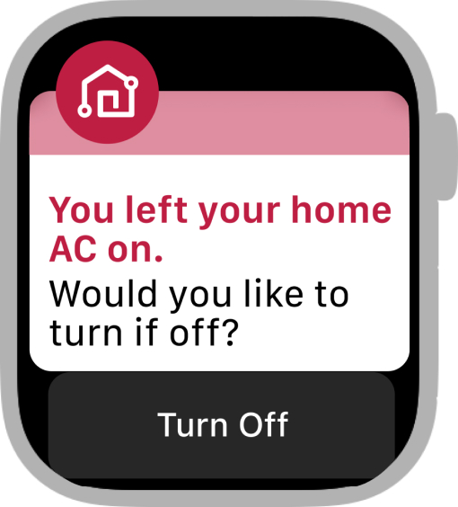
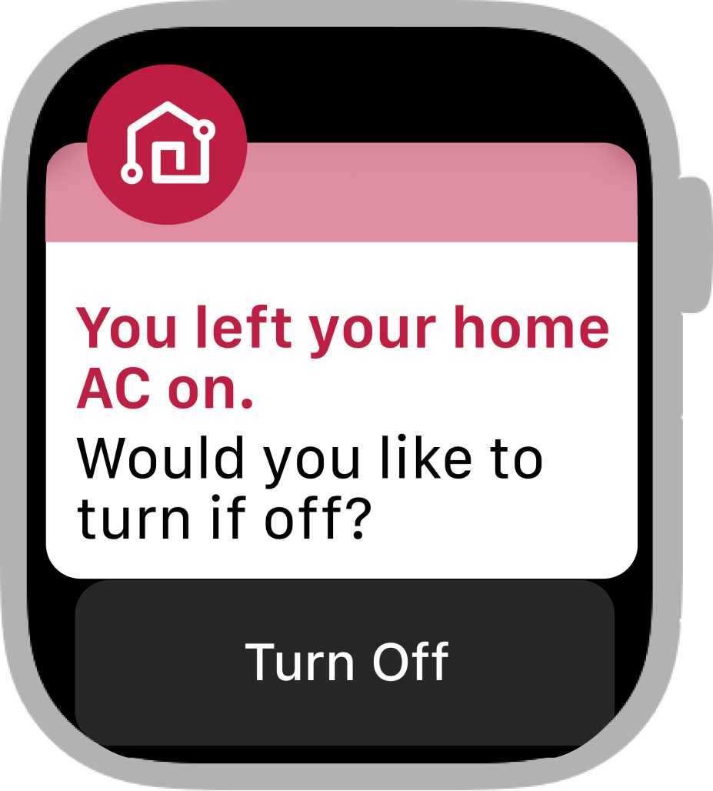
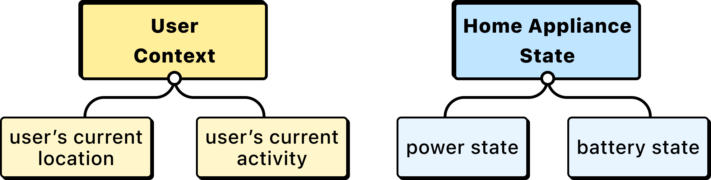
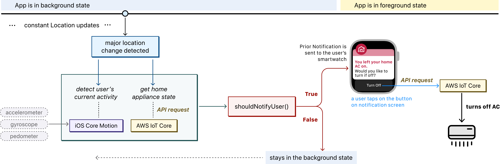
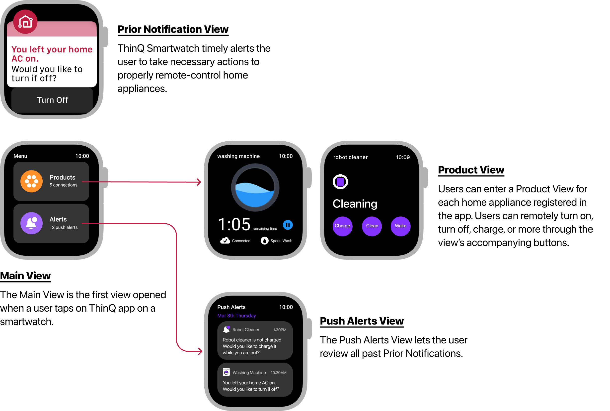
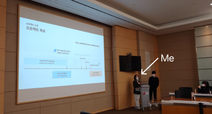

### About The Project
---
While I worked as a research engineer at LG Electronics’ IoT Technologies Group, I designed and prototyped LG ThinQ app for smartwatches. Working closely with the team’s designer and engineers, I solved the problem of low user engagement rate of the prevsiouly existing ThinQ for smartphone.

### What is ThinQ for Smartwatch?
---
LG Electronic’s ThinQ is an app that acts a central hub of LG’s smart home ecosystem, allowing users to remotely control and monitor their smart home appliances throuh cloud computing.

ThinkQ originally only supported access through smartphones. To improve the user engagement rate which only marked 36% on smartphones, I led the taskforce to extend ThinkQ to wearable devices. I leveraged the embedded sensors that provide accurate user context-recognition, and convenient usability of smartwatch. At the end of the project, I successfully convinced the leadership of the group to kickstart the service on smartwatch.

### Understanding The Key Problem
---
The problem I was given to tackle was ThinQ’s low user engagement rate.

The main source of low user engagement rate was that users were simply not used to remotely control the home appliances.
As a result, the smartphone the app was useful only if the users consciously remembered to remotely control their home appliances using their smartphones.
* E.g., A user who left her home AC on on her way out to work is able to remotely turn it off via ThinQ, but only if she somehow noticed by herself that her home AC was still on.

<!-- `video: https://www.youtube.com/embed/2Xc9gXyf2G4` -->

### UX Design and Technical Solution
---
With such insight, I both designed and implemented a prototype for a new feature dubbed prior notification on smartwatch.

#### Prior Notification
Prior Notification is a notification sent on the user’s smartwatch to timely prompt the user to remotely control their home appliances. Users can simply tap on a button in the notifiction screen to do so. 

    

<!--  -->

#### How Does It Work?
Prior Notification tracks the user context and the state of home appliances.
When the user context and home appliances’ state satisfy our pre-defined conditions, the Prior Notification is triggered to the user’s smartwatch. 

    

User context includes user’s current location and current activity. User’s Location is constantly updated through a GPS inside a smartwatch. User’s Activity type is recognized by machine learning-based Human Activity Recognition that leverages accelerometer, gyroscope, and pedometer, embedded in a smartwatch.

Home Appliance State includes the power and the battery state of each home appliance that is registered to the user’s ThinQ. Power state refers to if the appliance is connected to power. Battery state refers to battery charge status, if battery is required for the appliance to operate. The app sends a network request to AWS to get updates on power and battery state.

#### Why Implement on Smartwatch?
Smartwatch apps can leverage various sensor data that reveal more personal and pervasive information of the user compared to smartphones, and this is essential for user context recogntion.
e.g., workout recogntion, hand gesture-recognition, heart rate sensing, etc.

Moreover, smartwatch notifications channel various user interactions with just a single tap on a button on the notification screen. On the other hand, smartphone notifications require several depths of interactions to trigger the target action. This is because a smartwatch is designed to induce quick, on-the-fly user interactions, whereas a smartphone is designed for more complicated interactions.

### System Architecture
The system pipeline for tracking user context and monitoring home appliance state is visualized in the below figure. Most of the system’s logic runs in the background state, except for when the prior notification is triggered. We also optimized the system by triggering activity recognition and networking to a cloud server only when a major location change is detected.

    

### Final Output, Impacts
These are the screens of ThinQ on Apple Watch. 

    

Implicit interactions enable seamless experience; it is less explicit on the surface, but much more essential for more pervasive computing.

At the end of the project, I was given a chance to present this prototype to LG Electronics IoT Technologies Group. 
I was able to successfully convince the leadership to kickstart the ThinQ service for smartwatches. 
The project is under progress.

    

